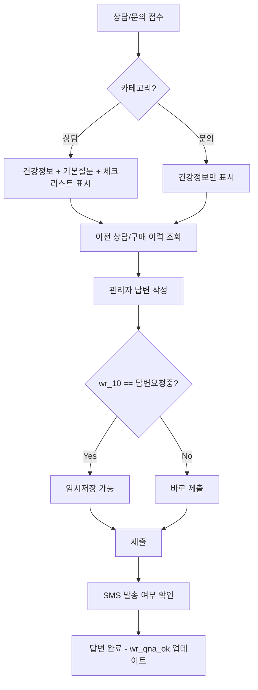

# 데이터베이스 구조

## 개요

- **데이터베이스명**: `littleyaksa`
- **테이블명**: `g5_write_counseling2`
- **엔진**: MyISAM
- **문자셋**: utf8
- **용도**: 건강기능식품 상담/문의 게시판 (그누보드5 기반)

---

## 테이블 스키마

### `g5_write_counseling2`

| 컬럼명 | 타입 | 기본값 | NULL | 설명 |
|--------|------|--------|------|------|
| `wr_id` | int(11) | AUTO_INCREMENT | NOT NULL | **PK**. 게시글 고유 ID |
| `wr_num` | int(11) | 0 | NOT NULL | 게시글 그룹 번호 |
| `wr_reply` | varchar(10) | - | NOT NULL | 답글 정렬 순서 |
| `wr_parent` | int(11) | 0 | NOT NULL | 부모 글 ID |
| `wr_is_comment` | tinyint(4) | 0 | NOT NULL | 댓글 여부 (0: 글, 1: 댓글) |
| `wr_comment` | int(11) | 0 | NOT NULL | 댓글 수 |
| `wr_comment_reply` | varchar(5) | - | NOT NULL | 댓글 답글 정렬 순서 |
| `ca_name` | varchar(255) | - | NOT NULL | 카테고리명 (`상담`, `문의` 등) |
| `wr_option` | set('html1','html2','secret','mail') | - | NOT NULL | 글 옵션 |
| `wr_subject` | varchar(255) | - | NOT NULL | 제목 |
| `wr_content` | text | - | NOT NULL | 질문 (상담/문의 내용) |
| `wr_link1` | text | - | NOT NULL | 링크 1 |
| `wr_link2` | text | - | NOT NULL | 링크 2 |
| `wr_link1_hit` | int(11) | 0 | NOT NULL | 링크 1 클릭수 |
| `wr_link2_hit` | int(11) | 0 | NOT NULL | 링크 2 클릭수 |
| `wr_hit` | int(11) | 0 | NOT NULL | 조회수 |
| `wr_good` | int(11) | 0 | NOT NULL | 추천수 |
| `wr_nogood` | int(11) | 0 | NOT NULL | 비추천수 |
| `mb_id` | varchar(20) | - | NOT NULL | 회원 ID |
| `wr_password` | varchar(255) | - | NOT NULL | 비밀번호 (비회원용) |
| `wr_name` | varchar(255) | - | NOT NULL | 작성자 이름 |
| `wr_email` | varchar(255) | - | NOT NULL | 작성자 이메일 |
| `wr_homepage` | varchar(255) | - | NOT NULL | 작성자 홈페이지 |
| `wr_datetime` | datetime | 0000-00-00 00:00:00 | NOT NULL | 작성일시 |
| `wr_file` | tinyint(4) | 0 | NOT NULL | 첨부파일 수 |
| `wr_last` | varchar(19) | - | NOT NULL | 마지막 수정일시 |
| `wr_ip` | varchar(255) | - | NOT NULL | 작성자 IP |
| `wr_facebook_user` | varchar(255) | - | NOT NULL | Facebook 사용자 |
| `wr_twitter_user` | varchar(255) | - | NOT NULL | Twitter 사용자 |
| `wr_1` | varchar(255) | - | NOT NULL | 대상 성별 |
| `wr_2` | varchar(255) | - | NOT NULL | 대상 나이 (파이프 구분: `나이코드\|직접입력`) |
| `wr_3` | varchar(255) | - | NOT NULL | 관심분야 (파이프 구분, 복수 선택 가능) |
| `wr_4` | varchar(255) | - | NOT NULL | 임산부/수유부 여부 (파이프 구분: `코드\|직접입력`) |
| `wr_5` | varchar(255) | - | NOT NULL | 체중 *(상담 카테고리 전용)* |
| `wr_6` | varchar(255) | - | NOT NULL | 현재 섭취중인 건강기능식품 및 기타제품 *(상담 전용)* |
| `wr_7` | varchar(255) | - | NOT NULL | 관심 있는 제품 *(상담 전용)* |
| `wr_8` | varchar(255) | - | NOT NULL | 체크리스트 (파이프 구분, 최대 39개 항목) *(상담 전용)* |
| `wr_9` | varchar(255) | - | NOT NULL | (미사용 또는 예비) |
| `wr_10` | varchar(255) | - | NOT NULL | 상태값 (예: `답변요청중`) |
| `wr_trackback` | varchar(255) | - | NOT NULL | 트랙백 |
| `wr_qna` | text | - | NOT NULL | 관리자 답변 |
| `wr_qna_ok` | tinyint(1) | - | NOT NULL | 답변 완료 여부 (0: 미답변, 1: 답변완료) |
| `wr_qna_html` | tinyint(4) | - | NOT NULL | 답변 웹에디터 사용 여부 |
| `wr_admin` | text | - | NOT NULL | 관리자 메모 |
| `date2` | varchar(255) | - | NOT NULL | 보조 날짜 |
| `wr_is_temp` | tinyint(4) | - | NOT NULL | 임시저장 여부 |

### 인덱스

| 인덱스명 | 컬럼 | 타입 |
|----------|------|------|
| `PRIMARY` | `wr_id` | PRIMARY KEY |
| `wr_num_reply_parent` | `wr_num`, `wr_reply`, `wr_parent` | INDEX |
| `wr_is_comment` | `wr_is_comment`, `wr_id` | INDEX |

---

## 커스텀 필드 (`wr_1` ~ `wr_10`) 상세 매핑

그누보드5의 여분필드(`wr_1` ~ `wr_10`)를 상담 업무에 맞게 커스터마이즈하여 사용합니다.

### `wr_1` — 대상 성별

단일 값. `$mustMent` 배열의 코드값으로 저장.

### `wr_2` — 대상 나이

파이프(`|`)로 구분된 2개 값:

| 인덱스 | 내용 |
|--------|------|
| `wr_2[0]` | 나이 코드 (`$mustMent` 매핑) |
| `wr_2[1]` | 직접 입력 (부가 정보) |

### `wr_3` — 관심분야

파이프(`|`)로 구분된 최대 5개 값 (복수 선택):

| 인덱스 | 내용 |
|--------|------|
| `wr_3[0]` ~ `wr_3[4]` | 관심분야 코드 (`$mustMent` 매핑) |

### `wr_4` — 임산부/수유부

파이프(`|`)로 구분된 2개 값:

| 인덱스 | 내용 |
|--------|------|
| `wr_4[0]` | 임산부/수유부 코드 (`$mustMent` 매핑) |
| `wr_4[1]` | 직접 입력 (부가 정보) |

### `wr_5` — 체중

단일 값. `$mustMent` 배열의 코드값으로 저장. **상담 카테고리 전용.**

### `wr_6` — 현재 섭취중인 건강기능식품 및 기타제품

자유 텍스트. **상담 카테고리 전용.**

### `wr_7` — 관심 있는 제품

자유 텍스트. **상담 카테고리 전용.**

### `wr_8` — 체크리스트 (상담 카테고리 전용)

파이프(`|`)로 구분된 최대 **39개 항목**. 각 항목은 `$mustMent` 배열의 코드값으로 저장.

| 인덱스 | 내용 |
|--------|------|
| `wr_8[0]` | 야식 섭취량 |
| `wr_8[1]` | 밀가루 음식(간식, 식사) 섭취량 |
| `wr_8[2]` | 우유, 유제품 섭취량 |
| `wr_8[3]` | 커피, 청량음료 섭취량 |
| `wr_8[4]` | 수분(200ml컵 기준) 섭취량 |
| `wr_8[5]` | 음주 정도 |
| `wr_8[6]` | 수면시간 |
| `wr_8[7]` | 수면의 질 |
| `wr_8[8]` | 정신적 스트레스, 육체적 노동 |
| `wr_8[9]` | 운동여부 (하루 30분 이상) |
| `wr_8[10]` | 흡연여부 |
| `wr_8[11]` ~ `wr_8[27]` | 어른/아이 공통 체크 항목 (17개) |
| `wr_8[28]` ~ `wr_8[32]` | 여성 추가 체크 항목 (5개) |
| `wr_8[33]` ~ `wr_8[37]` | 아이 추가 체크 항목 (5개) |
| `wr_8[38]` | (예비) |

### `wr_9` — (미사용)

현재 뷰에서 사용되지 않음. 예비 필드.

### `wr_10` — 상태값

상담 프로세스 상태를 저장. 확인된 값:
- `답변요청중` — 임시저장 버튼 활성화

---

## 카테고리(`ca_name`)별 분기

| 카테고리 | 사용 필드 | 비고 |
|----------|-----------|------|
| `상담` | `wr_1` ~ `wr_8`, `wr_10` 전체 사용 | 기본질문 + 체크리스트 섹션 표시, 문의하기답변(`wr_qna2`) 복사 기능 제공 |
| 기타 (예: `문의`) | `wr_1` ~ `wr_4` 사용 | 건강정보(필수) 섹션만 표시 |

---

## 관련 테이블 참조

### 회원 테이블 (그누보드5 `g5_member`)

`mb_id` 컬럼을 통해 회원 테이블을 조인하며, 뷰에서 다음 회원 정보를 표시합니다:

| 필드 | 설명 |
|------|------|
| `mb_id` | 회원 아이디 |
| `mb_name` | 이름 |
| `mb_nick` | 별명 |
| `mb_email` | 이메일 |
| `mb_homepage` | 홈페이지 |
| `mb_tel` | 연락처 |
| `mb_hp` | 핸드폰 |
| `mb_zip1`, `mb_zip2` | 우편번호 |
| `mb_addr1`, `mb_addr2` | 주소 |
| `mb_birth` | 생년월일 |
| `mb_sex` | 성별 |
| `mb_admin_memo` | 관리자 메모 (공통) |

---

## 관리자 답변 워크플로우

---

## 참고 사항

- 모든 `$mustMent` 코드값은 별도의 코드 매핑 배열에서 관리됩니다 (PHP 코드 내 정의).
- `wr_qna2` 필드는 SQL 스키마에는 없으나, 뷰에서 `문의하기답변` 복사용으로 참조됩니다. 별도 처리 또는 추가 컬럼이 존재할 수 있습니다.
- 폼 제출 시 `qna2_form_update_new.php`로 전송되며, `w` 파라미터로 동작을 구분합니다:
  - `u` — 업데이트 (기본)
  - `d` — 삭제
  - `c` — 문의글 복사 생성
  - `s` — 임시저장
